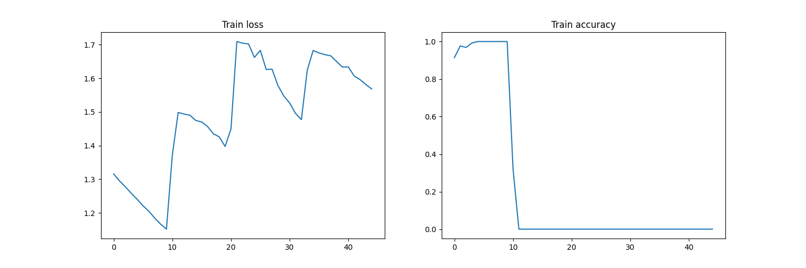
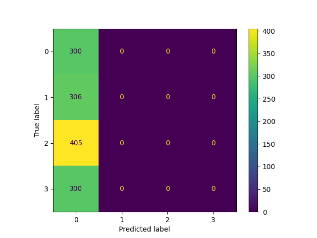
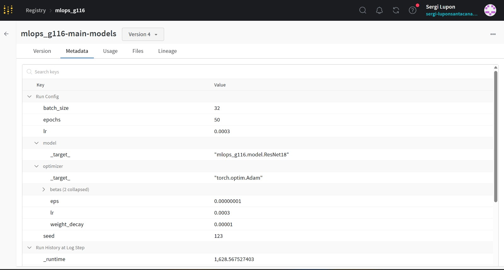
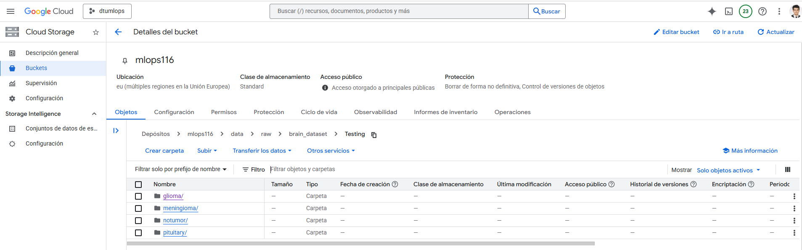
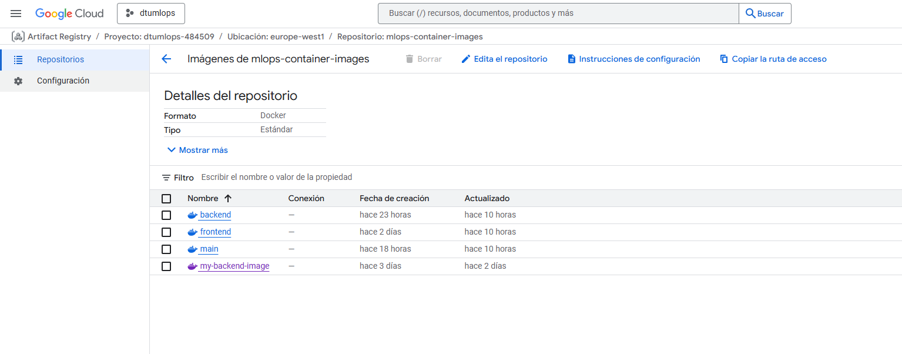
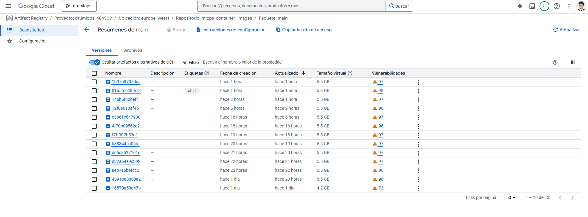
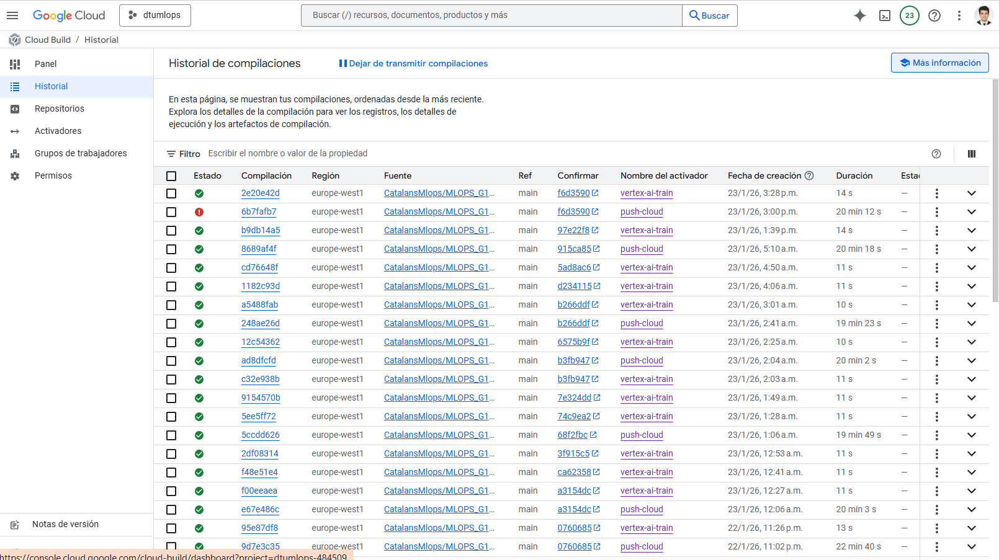
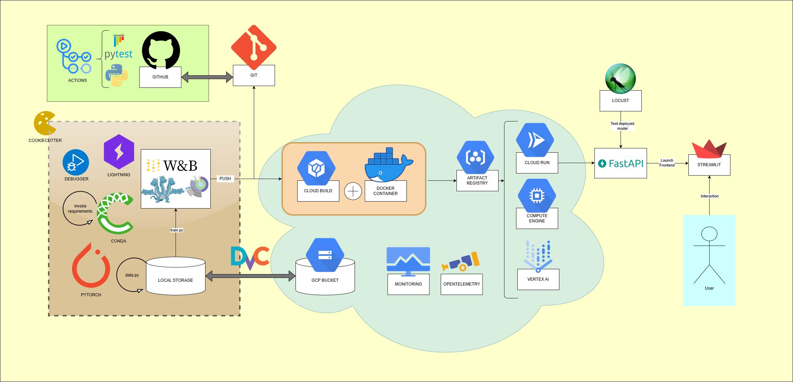

# Exam template for 02476 Machine Learning Operations

This is the report template for the exam. Please only remove the text formatted as with three dashes in front and behind
like:

```--- question 1 fill here ---```

Where you instead should add your answers. Any other changes may have unwanted consequences when your report is
auto-generated at the end of the course. For questions where you are asked to include images, start by adding the image
to the `figures` subfolder (please only use `.png`, `.jpg` or `.jpeg`) and then add the following code in your answer:

``

In addition to this markdown file, we also provide the `report.py` script that provides two utility functions:

Running:

```bash
python report.py html
```

Will generate a `.html` page of your report. After the deadline for answering this template, we will auto-scrape
everything in this `reports` folder and then use this utility to generate a `.html` page that will be your serve
as your final hand-in.

Running

```bash
python report.py check
```

Will check your answers in this template against the constraints listed for each question e.g. is your answer too
short, too long, or have you included an image when asked. For both functions to work you mustn't rename anything.
The script has two dependencies that can be installed with

```bash
pip install typer markdown
```

or

```bash
uv add typer markdown
```

## Overall project checklist

The checklist is *exhaustive* which means that it includes everything that you could do on the project included in the
curriculum in this course. Therefore, we do not expect at all that you have checked all boxes at the end of the project.
The parenthesis at the end indicates what module the bullet point is related to. Please be honest in your answers, we
will check the repositories and the code to verify your answers.

### Week 1

* [X] Create a git repository (M5)
* [X] Make sure that all team members have write access to the GitHub repository (M5)
* [X] Create a dedicated environment for you project to keep track of your packages (M2)
* [X] Create the initial file structure using cookiecutter with an appropriate template (M6)
* [X] Fill out the `data.py` file such that it downloads whatever data you need and preprocesses it (if necessary) (M6)
* [X] Add a model to `model.py` and a training procedure to `train.py` and get that running (M6)
* [X] Remember to either fill out the `requirements.txt`/`requirements_dev.txt` files or keeping your
    `pyproject.toml`/`uv.lock` up-to-date with whatever dependencies that you are using (M2+M6)
* [X] Remember to comply with good coding practices (`pep8`) while doing the project (M7)
* [X] Do a bit of code typing and remember to document essential parts of your code (M7)
* [X] Setup version control for your data or part of your data (M8)
* [X] Add command line interfaces and project commands to your code where it makes sense (M9)
* [X] Construct one or multiple docker files for your code (M10)
* [X] Build the docker files locally and make sure they work as intended (M10)
* [X] Write one or multiple configurations files for your experiments (M11)
* [X] Used Hydra to load the configurations and manage your hyperparameters (M11)
* [X] Use profiling to optimize your code (M12)
* [X] Use logging to log important events in your code (M14)
* [X] Use Weights & Biases to log training progress and other important metrics/artifacts in your code (M14)
* [X] Consider running a hyperparameter optimization sweep (M14)
* [X] Use PyTorch-lightning (if applicable) to reduce the amount of boilerplate in your code (M15)

### Week 2

* [X] Write unit tests related to the data part of your code (M16)
* [X] Write unit tests related to model construction and or model training (M16)
* [X] Calculate the code coverage (M16)
* [X] Get some continuous integration running on the GitHub repository (M17)
* [X] Add caching and multi-os/python/pytorch testing to your continuous integration (M17)
* [X] Add a linting step to your continuous integration (M17)
* [X] Add pre-commit hooks to your version control setup (M18)
* [ ] Add a continues workflow that triggers when data changes (M19)
* [ ] Add a continues workflow that triggers when changes to the model registry is made (M19)
* [X] Create a data storage in GCP Bucket for your data and link this with your data version control setup (M21)
* [X] Create a trigger workflow for automatically building your docker images (M21)
* [X] Get your model training in GCP using either the Engine or Vertex AI (M21)
* [X] Create a FastAPI application that can do inference using your model (M22)
* [X] Deploy your model in GCP using either Functions or Run as the backend (M23)
* [X] Write API tests for your application and setup continues integration for these (M24)
* [X] Load test your application (M24)
* [ ] Create a more specialized ML-deployment API using either ONNX or BentoML, or both (M25)
* [X] Create a frontend for your API (M26)

### Week 3

* [ ] Check how robust your model is towards data drifting (M27)
* [ ] Setup collection of input-output data from your deployed application (M27)
* [ ] Deploy to the cloud a drift detection API (M27)
* [ ] Instrument your API with a couple of system metrics (M28)
* [ ] Setup cloud monitoring of your instrumented application (M28)
* [ ] Create one or more alert systems in GCP to alert you if your app is not behaving correctly (M28)
* [ ] If applicable, optimize the performance of your data loading using distributed data loading (M29)
* [ ] If applicable, optimize the performance of your training pipeline by using distributed training (M30)
* [ ] Play around with quantization, compilation and pruning for you trained models to increase inference speed (M31)

### Extra

* [ ] Write some documentation for your application (M32)
* [ ] Publish the documentation to GitHub Pages (M32)
* [X] Revisit your initial project description. Did the project turn out as you wanted?
* [X] Create an architectural diagram over your MLOps pipeline
* [X] Make sure all group members have an understanding about all parts of the project
* [X] Uploaded all your code to GitHub

## Group information

### Question 1
> **Enter the group number you signed up on <learn.inside.dtu.dk>**
>
> Answer:

>Group 116

### Question 2
> **Enter the study number for each member in the group**
>
> Answer:

> s254311, s253742, s253749

### Question 3
> **Did you end up using any open-source frameworks/packages not covered in the course during your project? If so**
> **which did you use and how did they help you complete the project?**
>
> Answer:

> No. We did not use open-source frameworks or packages outside the course syllabus. The tools covered in the  course already provided everything we needed for data versioning, experimentation, deployment, testing, and monitoring, so we did not add any external frameworks beyond those.

## Coding environment

> In the following section we are interested in learning more about you local development environment. This includes
> how you managed dependencies, the structure of your code and how you managed code quality.

### Question 4

> **Explain how you managed dependencies in your project? Explain the process a new team member would have to go**
> **through to get an exact copy of your environment.**
>
>
> Answer:

>We used Conda to manage all our project dependencies and ensure that the development environment is consistent across different machines. The list of dependencies was automatically generated using pip freeze and pipreqs to capture the exact versions of all Python packages installed during development. To replicate the development environment exactly, a new team member would need to follow these steps: 1) git clone <repository> to get a local copy of the project 2) pip install invoke to install the task runner we use for automating setup commands 3) invoke create_environment to create the Conda env and then run invoke requirements plus invoke dev_requirements to install requirements.txt and the dev tools with pinned versions 4) invoke gcloud, which runs gcloud auth application-default login to authenticate with Google Cloud Platform and grant the necessary permissions to access the dtu_mlops project. After completing these steps, the new team member will have a fully functional development environment with all dependencies installed and properly configured, including access to cloud resources needed for the project. For extra reproducibility we include a Dev Container (Python 3.12-slim) that installs the same requirements, and Dockerfiles for backend/frontend/train images to pin runtime dependencies in deployment environments.

### Question 5

> **We expect that you initialized your project using the cookiecutter template. Explain the overall structure of your**
> **code. What did you fill out? Did you deviate from the template in some way?**
>
>
> Answer:

>Compared to the cookiecutter template, we kept the same high-level folders (src, tests, configs, dockerfiles, reports, docs) but extended them for our workflow. In src/mlops_g116 we added a unified main.py that runs training, evaluation, and visualization in one Hydra-driven run, plus parallel boilerplate variants (train_boilerplate.py, model_boilerplate.py) for experiments. We introduced data_importfromcloud.py to preprocess directly from GCS when a DVC pull is not desired, while still keeping the local data pipeline. We expanded configs with dataset/model/optimizer/training subfolders plus evaluation/visualization, a vertex/ section for cloud training, and cloudbuild.yaml for Docker image builds. For deployment and reproducibility we added several Dockerfiles: main.dockerfile, main.CPU.dockerfile, and main.local.dockerfile for the core pipeline; train.local.dockerfile for local training; plus backend/frontend/evaluate/visualize images, each paired with *_entrypoint.sh scripts. We also added a Dev Container and separate requirements files (runtime, dev, backend, frontend, GPU).

### Question 6

> **Did you implement any rules for code quality and format? What about typing and documentation? Additionally,**
> **explain with your own words why these concepts matters in larger projects.**
>
>
> Answer:

>We enforced code quality with Ruff (ruff check) and formatting with ruff format, aligned with PEP8 and run in CI/pre-commit. We also used type hints throughout the Python modules and docstrings  on functions/classes so behavior and inputs are explicit. These practices matter in larger projects because many contributors touch the same code: consistent formatting reduces review noise, linting catches errors and unused code early, and typing makes interfaces clear, enabling tooling and safer refactors. Documentation and docstrings are essential for onboarding and long-term maintenance; they preserve context, make experiments reproducible, and reduce the bus-factor when team members change or revisit the code later.

## Version control

> In the following section we are interested in how version control was used in your project during development to
> corporate and increase the quality of your code.

### Question 7

> **How many tests did you implement and what are they testing in your code?**
>
>
> Answer:

>We organized our pytest into subfolders for unit, integration and performance tests. Unit tests validate the core modules (data loading/preprocessing, model shapes, training/evaluation utilities, registry download, and frontend logic) to catch regressions early. Integration tests exercise the FastAPI `/classify` endpoint end-to-end with an in-memory image to confirm the full inference pipeline works. Performance tests (Locust) simulate concurrent users to measure latency and throughput. We also run pytest in GitHub Actions (CI) to ensure tests execute on every push/PR. This setup ensures correctness across components and realistic usage scenarios.

### Question 8

> **What is the total code coverage (in percentage) of your code? If your code had a code coverage of 100% (or close**
> **to), would you still trust it to be error free? Explain you reasoning.**
>
>
> Answer:

>Our total coverage is 58% (619 misses out of 1479 statements). The low overall number is mainly driven by the large `main.py` (25%) and `train.py` (21%), which include many branches for profiling, logging, cloud uploads, and W&B setup that are hard to exercise in unit tests. Most other modules are above ~75%, with several in the 90% range (backend, frontend, data_importfromcloud, model, registry_download). We cover all key files, which is valuable even if the aggregate is lower. We generate this with the Invoke task `invoke coverage`. We attempted to upload coverage reports to Codecov, but it was costly/complicated for our setup, so we kept local reports. Even with higher coverage we would not trust the system to be error‑free, since tests reduce risk but cannot cover every runtime or data edge case.

### Question 9

> **Did you workflow include using branches and pull requests? If yes, explain how. If not, explain how branches and**
> **pull request can help improve version control.**
>
>
> Answer:

>We made use of both branches and pull requests (PRs) in our project. Each group member worked on their own branch. On the remote repository, we had four branches (main and three personal branches), while locally each member had two branches (main and their personal branch). When it was time to upload changes, we added, committed, and pushed the personal branch. After GitHub Actions passed all tests, we opened a pull request to merge the personal branch into main. Once the tests passed again, we authorized the merge and pulled main locally. Pull requests helped improve version control by enforcing code reviews and automated testing before any changes were merged into the main branch. This ensured that new features or fixes were validated, reduced the risk of introducing errors, and maintained a clear and traceable history of changes. This workflow allowed us to resolve issues without affecting the protected main branch.


### Question 10

> **Did you use DVC for managing data in your project? If yes, then how did it improve your project to have version**
> **control of your data. If no, explain a case where it would be beneficial to have version control of your data.**
>
> Answer:

>Yes, we used DVC to manage the data in our project. DVC allowed us to version control large datasets without storing them directly in Git, which would have been inefficient given the size of the data. By storing the raw dataset in a cloud storage bucket and tracking it through DVC, we maintained a reproducible link between versions of the data and the corresponding code. This improved the reliability of the project, as each experiment or model could be traced to the exact dataset used. DVC enabled efficient collaboration among team members by allowing quick and consistent data synchronization using commands such as -dvc pull-. This ensured that all contributors worked with the same data version, reduced inconsistencies across environments, and simplified the setup process when cloning the repository. In containers (Docker/Cloud Run) we avoided dvc push because it requires git metadata and adding `.dvc` files, which is brittle/inefficient inside images. For non data folders like `outputs/` (run artifacts already stored in the bucket) we used direct GCS uploads instead. Locally we used personal credentials, while CI/containers used a service account to grant least privilege access to the bucket; this was essential to automate pulls/uploads and avoid manual logins.


### Question 11

> **Discuss you continuous integration setup. What kind of continuous integration are you running (unittesting,**
> **linting, etc.)? Do you test multiple operating systems, Python  version etc. Do you make use of caching? Feel free**
> **to insert a link to one of your GitHub actions workflow.**
>
>
> Answer:

> Our CI lives in `.github/workflows/` with two pipelines. `tests.yaml` runs on every push/PR and uses a matrix over Ubuntu, Windows, and macOS to catch OS-specific issues. It sets up Python 3.12 (matching our project requirement) and enables pip caching via `actions/setup-python` (keyed on `requirements.txt`, `requirements_dev.txt`, and `pyproject.toml`) to speed up repeat runs. The job installs dependencies, performs an editable install of the package, and runs `pytest tests/`. It also authenticates to GCP when the service‑account secret is present and conditionally performs a `dvc pull`, so integration tests can run with real data while still succeeding on forks where secrets are missing. We set `fail-fast: false` to surface all OS failures in one run. `linting.yaml` is a separate job that installs dependencies and runs `ruff check` plus `ruff format --check` to enforce linting and formatting. We keep a Dependabot config for automated dependency update PRs and a pre-commit config for local checks before pushing. We considered a Python-version matrix, but several dependencies are pinned for 3.12, so we aligned CI with our runtime to avoid incompatibilities. We also tie CI to our branching policy: feature branches must pass these checks before opening a PR to main, keeping the protected default branch stable. Overall, the CI focuses on fast feedback, reproducible installs, and cross‑platform robustness.

>Link to GitHub actions workflows (run IDs):
>```
>https://github.com/CatalansMlops/MLOPS_G116/actions/runs/21299897999
>https://github.com/CatalansMlops/MLOPS_G116/actions/runs/21299897996
>```

## Running code and tracking experiments

> In the following section we are interested in learning more about the experimental setup for running your code and
> especially the reproducibility of your experiments.

### Question 12

> **How did you configure experiments? Did you make use of config files? Explain with coding examples of how you would**
> **run a experiment.**
>
> Answer:

>We configured experiments with Hydra and the `configs/` tree. `main.py`, `train.py`, `evaluate.py`, and
`visualize.py` use `@hydra.main` and load `config.yaml`, which composes `model/`, `optimizer/`, and `training/` and
uses `instantiate` targets. `evaluate.yaml` and `visualize.yaml` redirect to `evaluation/` and `visualization/` while reusing the same model/data components. We override params from the CLI (e.g., `python src/mlops_g116/train.py optimizer.lr=1e-3 training.batch_size=32`) and Hydra stores outputs for reproducibility. We also keep `sweep.yaml` for W&B sweeps. Typer and the debugger (default.json) are only for small utilities.

### Question 13

> **Reproducibility of experiments are important. Related to the last question, how did you secure that no information**
> **is lost when running experiments and that your experiments are reproducible?**
>
>
> Answer:

>Reproducibility relied on Hydra, logging, and consistent runtime environments. We set seeds
(`torch.manual_seed`) in training/evaluation runs and stored full configs through Hydra outputs, so each run keeps an exact copy of hyperparameters and component choices. We log metrics and artifacts to W&B and locally via Loguru (plus Hydra’s run directory), including confusion matrices, t‑SNE plots, and model checkpoints like `model.pth`. Outputs and profiler traces are kept in the GCS bucket, giving a durable record of each experiment; we also used TensorBoard and Snakeviz to capture performance profiles, and were automatically displayed just by running the python scripts, and by configuring ports. For environment reproducibility we used a Dev Container so developers run in a consistent Python 3.12 image, and multiple Dockerfiles for specific tasks (main/train/evaluate/visualize, backend/frontend). We kept variants for local vs cloud runs (CPU, local, cloud), including containers that read data from local processed files, via DVC pulls, or directly from GCS using service‑account credentials. The main container is the reference for hyperparameter optimization and W&B sweeps (`sweep.yaml`), and we can rerun any configuration by pointing to the same config and artifact versions. Together, seeded training, logged configs/artifacts, and containerized environments made experiments repeatable across machines and cloud runs.

### Question 14

> **Upload 1 to 3 screenshots that show the experiments that you have done in W&B (or another experiment tracking**
> **service of your choice). This may include loss graphs, logged images, hyperparameter sweeps etc. You can take**
> **inspiration from [this figure](figures/wandb.png). Explain what metrics you are tracking and why they are**
> **important.**
>
>
> Answer:

> We used W&B as the main experiment tracker and artifact registry, and complemented it with profiling/logging tools across training, evaluation, and visualization. For profiling we used the PyTorch profiler to emit trace files, TensorBoard to inspect operator timelines and GPU/CPU utilization, and Snakeviz for cProfile outputs; these are saved under Hydra run folders and uploaded to the outputs bucket for later inspection. For logging we relied on Hydra run directories, Loguru logs, and W&B. In W&B we tracked train/val/test metrics such as loss, accuracy, precision, recall, and F1, logged per‑epoch curves, and stored evaluation artifacts like confusion matrices and t‑SNE embeddings. These signals guided model selection across manual runs (local or Vertex AI) and automated sweeps via `sweep.yaml`, where we varied learning rate, optimizer, model backbone, batch size, and epochs. We also logged and versioned `model.pth`, plus run artifacts (configs, metrics JSON, profiler traces) so the best configuration can be reproduced exactly. Runs are organized by job type (train/evaluate/visualize), and W&B artifacts/collections separate model and evaluation outputs to keep lineage clear. The `registry_download.py` utility pulls a specific registered model/alias from the W&B
registry, tying deployment to a versioned artifact and ensuring traceability from API predictions back to the training run. Examples below show training statistics, an evaluation confusion matrix, and the W&B artifact view for model lineage.





### Question 15

> **Docker is an important tool for creating containerized applications. Explain how you used docker in your**
> **experiments/project? Include how you would run your docker images and include a link to one of your docker files.**
>
>
> Answer:

> We used Docker to standardize experiments and deployments. We maintain multiple images in `dockerfiles/`: a main image for the end‑to‑end pipeline (train+eval+visualize), plus specialized backend/frontend images for Cloud Run and local training/evaluation variants, each with entrypoint scripts. For reproducible local work we also use a Dev Container that mirrors the same Python environment. In the cloud we build/push images via `configs/cloudbuild.yaml` (Cloud Build), or locally and push to Artifact Registry. Example local run:
`docker run --rm --env-file .env -v $(pwd)/data:/app/data -v $(pwd)/outputs:/app/outputs main:latest`
We store secrets in `.env` (e.g., `WANDB_API_KEY`) and, when needed, mount a service‑account JSON and set
`GOOGLE_APPLICATION_CREDENTIALS` so containers can access GCS/DVC or Vertex AI. We also run Vertex AI jobs using
`configs/vertex/*.yaml` for CPU/GPU training and sweeps. Docker gives consistent environments across laptops and cloud.

>Link to Dockerfile:
```
https://github.com/CatalansMlops/MLOPS_G116/blob/main/dockerfiles/main.dockerfile
```

### Question 16

> **When running into bugs while trying to run your experiments, how did you perform debugging? Additionally, did you**
> **try to profile your code or do you think it is already perfect?**
>
>
> Answer:

> We mainly debugged with the VS Code debugger using launch configurations (default.json) for the train/evaluate/
visualize entrypoints. We set breakpoints, inspected tensors and configs, and used step‑through execution when
something failed. In practice we did not overuse interactive debugging; we relied more on clear logging (Loguru),
assertions, and quick reruns, and only switched to the debugger for critical, hard‑to‑trace issues. We also used
AI-assisted suggestions to speed up diagnosis when errors were non‑obvious.

>Profiling was more systematic. We added profiling hooks in most scripts and used the PyTorch profiler with TensorBoard to inspect hotspots and CPU utilization, plus Snakeviz for cProfile output. This was important when training for many epochs or running sweeps, where small inefficiencies are critical. Profiling results were logged with the run outputs to guide targeted optimizations.

## Working in the cloud

> In the following section we would like to know more about your experience when developing in the cloud.

### Question 17

> **List all the GCP services that you made use of in your project and shortly explain what each service does?**
>
>
> Answer:

> We used the following Google Cloud services: Cloud Build, Artifact Registry, Cloud Run, Compute Engine, Vertex AI and Cloud Storage (Bucket). Cloud Build handles building Docker images whenever a trigger occurs and pushes them to Artifact Registry, where the containers are securely stored. For this tool, we also programmed some triggers linked to the git repo that automatically conducts the docker images commands (build, push, deploy) by means of the cloudbuild.yaml file and is activated manually or whenever we do a git push on the main branch. Cloud Run then deploys and runs these containers, making the application publicly accessible. Compute Engine and Vertex AI are used to train our machine learning models, leveraging CPU and GPU resources to increase training speed. Finally, Cloud Storage (Bucket) is used to store the dataset in the cloud, ensuring easy access, version control and scalability. Together, these services provide a fully automated, efficient, and reliable pipeline for building, deploying and training our application in the cloud.

### Question 18

> **The backbone of GCP is the Compute engine. Explained how you made use of this service and what type of VMs**
> **you used?**
>
>
> Answer:

> We created a Compute Engine VM instance (x86‑64, 4 GB RAM, 2 GPUs) mainly as infrastructure support, but most of our ML training and deployment work was done in Vertex AI, which is more purpose‑built for ML/DL workloads. For Vertex AI jobs we selected a machine type n1-highmem-16 and an NVIDIA Tesla T4 (accelerator_count=1) to ensure enough RAM and GPU capacity for training and sweeps. The Compute Engine VM was still valuable because it provides a reproducible, isolated environment with stable dependencies, predictable hardware, and traceable configuration. It also let us work from our local machine while issuing Vertex AI commands (and other GCP tooling) reliably from a controlled environment, which reduced local setup friction and helped keep runs consistent across team members.

### Question 19

> **Insert 1-2 images of your GCP bucket, such that we can see what data you have stored in it.**
> **You can take inspiration from [this figure](figures/bucket.png).**
>
> Answer:




### Question 20

> **Upload 1-2 images of your GCP artifact registry, such that we can see the different docker images that you have**
> **stored. You can take inspiration from [this figure](figures/registry.png).**
>
> Answer:




### Question 21

> **Upload 1-2 images of your GCP cloud build history, so we can see the history of the images that have been build in**
> **your project. You can take inspiration from [this figure](figures/build.png).**
>
> Answer:




### Question 22

> **Did you manage to train your model in the cloud using either the Engine or Vertex AI? If yes, explain how you did**
> **it. If not, describe why.**
>
>
> Answer:

>We trained in Vertex AI using containers built in Cloud Build and pushed to Artifact Registry. The training job is
defined in configs/vertex/vertex_ai_train.yaml, with resource settings in configs/vertex/vertex.yaml and sweeps in
configs/vertex/vertex_sweep.yaml. Hyperparameters are supplied via Hydra configs and overrides, so we can adjust
model, optimizer, and training settings (or run sweeps) without rebuilding the image. This kept the image stable
while we experimented with learning rate, batch size, and model backbones. We did face practical challenges: GPU
availability and RAM limits affected sweep runs, and service‑account permissions had to be configured carefully for
GCS/DVC access. DVC pulls were slow inside Vertex jobs, so we changed some runs to read directly from the bucket using
credentials instead of pulling data into the container. Despite these hurdles, Vertex AI provided a managed workflow
with clear logs and repeatable runs that fit our project well.

## Deployment

### Question 23

> **Did you manage to write an API for your model? If yes, explain how you did it and if you did anything special. If**
> **not, explain how you would do it.**
>
> Answer:

>We developed an API for our model using FastAPI. The API consists of a root endpoint to test if the service is running and a /classify endpoint that takes in an image and returns the predictions of the best-performing trained model saved in models/model.pth. We implemented an asynchronous lifespan context manager (app = FastAPI(lifespan=lifespan)) to optimize the API's efficiency. This architectural pattern decouples the resource-heavy initialization logic (loading the model) from the request processing logic. Without this, the server would potentially reload the model weights from the disk for every incoming request, causing high latency. By using lifespan, we ensure the model is loaded into memory exactly once when the server starts up.


### Question 24

> **Did you manage to deploy your API, either in locally or cloud? If not, describe why. If yes, describe how and**
> **preferably how you invoke your deployed service?**
>
> Answer:

> We successfully deployed our API both locally (running it via the command line and containerized with docker run) and in the cloud using Google Cloud Run. To deploy to the cloud, we created a Dockerfile (backend.dockerfile) that sets up the necessary environment and dependencies. After building the Docker image, we tagged and pushed it to Google Cloud Artifact Registry. Then, we deployed the image to Cloud Run, configuring the service with unauthenticated access and assigning it sufficient memory resources (2GB). Cloud Run automatically provided a public URL for our API. To invoke the deployed API, you can run the following command: `curl -X POST "https://backend-277552599633.europe-west1.run.app/classify/"   -H "accept: application/json"   -F "file=@path_to_image.jpg;type=image/jpeg"`. Additonally, we set up continuous deployment using Google Cloud Build with the `cloudbuild.yaml`, which automatically builds and deploys the Docker image whenever changes are pushed to the main branch of our GitHub repository.

### Question 25

> **Did you perform any unit testing and load testing of your API? If yes, explain how you did it and what results for**
> **the load testing did you get. If not, explain how you would do it.**
>
>
> Answer:

>We implemented integration tests with Pytest that test how different components (FastAPI, PyTorch model, file handling) work together in the API. The tests verify the API is alive and reachable and validate the full machine learning inference pipeline: they confirm the loading of the PyTorch model, weights, and transforms into memory without crashing, test if the API accepts standard file uploads, verify that the model actually runs on the input and produces an output, and check that the output JSON contains the correct keys and returns exactly 4 classes. For load testing, we created a locustfile that simulates sending POST requests with image files to the /classify endpoint. We tested three scenarios: 1, 5, and 20 concurrent users. While performance remained stable at 1 and 5 users with no latency degradation, at 20 users, the system reached 7.0 RPS and began failing (significantly increased latency). In conclusion, our current Cloud Run deployment (1 CPU, 2GB RAM) supports relatively low traffic volumes. To increase capacity, we could increase the number of CPUs assigned to the service and, consequently, the number of workers running the API to utilize those CPUs.


### Question 26

> **Did you manage to implement monitoring of your deployed model? If yes, explain how it works. If not, explain how**
> **monitoring would help the longevity of your application.**
>
> Answer:

> We did not manage to implement monitoring for our deployed model. However, implementing monitoring would be important for ensuring the reliability of our application. Monitoring would allow us to track key performance metrics such as response times, error rates, and system resource usage (CPU, memory). These metrics would help us identify potential bottlenecks or failures in the system. For our project, target drift is a more practical strategy than data drift. While detecting drift in images requires complex, resource-heavy feature extraction, target drift simply analyzes the model's outputs. Any significant shift in the distribution of predicted classes could serve as an indicator of potential model failure.

## Overall discussion of project

> In the following section we would like you to think about the general structure of your project.

### Question 27

> **How many credits did you end up using during the project and what service was most expensive? In general what do**
> **you think about working in the cloud?**
>
> Answer:

> In total, we used kr130 out of kr8,237 available for our project. The most expensive service was Container Registry Vulnerability Scanning, which cost kr104, followed by Vertex AI and Cloud Run, each costing kr6, and Compute Engine and Artifact Registry, each costing kr4. Overall, working in the cloud was a very positive experience. It provided scalability, flexibility, and easy access to powerful computing resources without the need to maintain physical hardware. Services like Vertex AI and Cloud Run simplified deployment, automated resource management and allowed us to focus on developing and testing our model rather than managing infrastructure. However, there are some drawbacks. Cloud costs can increase quickly if resources are not managed carefully and understanding all the services and their configurations can be overwhelming at first. Despite these challenges, the advantages of speed, reproducibility, collaboration and low maintenance made cloud computing an excellent choice for our project.

### Question 28

> **Did you implement anything extra in your project that is not covered by other questions? Maybe you implemented**
> **a frontend for your API, use extra version control features, a drift detection service, a kubernetes cluster etc.**
> **If yes, explain what you did and why.**
>
>
> Answer:

> We implemented a frontend for our API using Streamlit. The frontend allows users to easily upload images and view the model's predictions in a user-friendly interface.  Users can upload an image, and upon submission, the frontend sends the image to the backend API (classify endpoint) for classification. The predictions are then displayed on the same page, providing immediate feedback to the user. The frontend is also containerized and deployed in Google Cloud Run and is publicly accessible in https://frontend-277552599633.europe-west1.run.app.

### Question 29

> **Include a figure that describes the overall architecture of your system and what services that you make use of.**
> **You can take inspiration from [this figure](figures/overview.png). Additionally, in your own words, explain the**
> **overall steps in figure.**
>
> Answer:



> We have implemented a fully automated CI/CD pipeline using a cloudbuild.yaml configuration file, designed to streamline the process of building, testing and deploying our application. Whenever changes are pushed to the main branch of our GitHub repository, the pipeline is automatically triggered. The Cloud Build service then takes over, building the Docker images for both the backend and frontend, and pushing them to Google Cloud Artifact Registry. Once the images are available, they are deployed to Google Cloud Run, making the application publicly accessible to users via a simple web interface.

>The web application allows users to upload MRI brain images and receive real-time feedback regarding their classification. To ensure data integrity and reproducibility, all uploaded files are stored in a Google Cloud Bucket and can also be downloaded locally using DVC, enabling robust version control over the dataset. The data.py script is responsible for processing these images, transforming .jpg files into tensors suitable for model inference and further analysis.

>To simplify the setup of development environments and the management of permissions, we created several helper functions in tasks.py. These functions automate repetitive tasks and reduce the time required for initial configuration, making it easier for team members to get started or maintain the system

>In addition to the Cloud Build pipeline, we have integrated GitHub Actions workflows that run automatically for every push. These workflows execute unit tests, verifying that all components of the application function correctly and ensuring that any new changes do not introduce errors.

>Overall, this CI/CD setup provides a fully automated, end-to-end workflow for deploying a machine learning application. It covers everything from code integration and containerization to deployment and testing, all while ensuring data versioning, reproducibility, and ease of use. This infrastructure allows users to seamlessly interact with the application, upload MRI images and receive immediate, reliable feedback on their classification results.

### Question 30

> **Discuss the overall struggles of the project. Where did you spend most time and what did you do to overcome these**
> **challenges?**
>
> Answer:

>The biggest struggles were around cloud infrastructure, reproducibility, and model performance. Setting up CI/CD with
Cloud Build + Cloud Run required careful IAM/service‑account permissions and secret handling. We initially embedded too
much config in images; we later moved credentials to mounted files and .env variables to avoid leaking secrets.
Cloud Run also exposed resource constraints: the backend crashed with 512MB RAM, so we increased to 2GB and adjusted
container startup. DVC was useful locally, but in cloud containers dvc pull was slow and required git metadata, so for
some runs we read directly from GCS using service‑account credentials. This added work to keep data versioning and
outputs consistent across environments.

>Experiment tracking and artifacts were another time sink. We invested time in wiring W&B (artifacts/collections,
job types, registry), Loguru, and Hydra outputs so that metrics, configs, and model.pth were all traceable. Getting
profiler outputs (TensorBoard + Snakeviz) into the same run folders and bucket also took iteration. On the modeling
side, the dataset is challenging (MRI slices with varying zoom/angles), and even with pretrained backbones we saw
overfitting and modest test accuracy. We considered cross‑validation but stuck to a hold‑out split due to time and
compute limits (local CPU training and limited GPU availability in Vertex AI). Sweeps in Vertex AI sometimes failed
due to RAM/GPU availability or long startup times, so we constrained sweep ranges and used smaller batches/epochs.

>We overcame these issues by adding multiple container variants for local vs cloud runs, standardizing configs with
Hydra, improving CI workflows with caching and OS matrices, and iterating on deployment resources and data access
paths. Overall, the time was split between cloud permissions/setup, experiment plumbing, and stabilizing training
performance.

### Question 31

> **State the individual contributions of each team member. This is required information from DTU, because we need to**
> **make sure all members contributed actively to the project. Additionally, state if/how you have used generative AI**
> **tools in your project.**
>
> Answer:

>Student s253742 focused on the deployment aspect of the project. This included writing the FastAPI backend application and the Streamlit frontend, containerizing them with Docker, and deploying them to Google Cloud Run. He also set up the CI/CD pipeline using Google Cloud Build to automate the build and deployment processes of them. Additionally, he contributed to writing integration and load tests for the API.
>
>Student s253749 focused on GCP. This included creating a Google Cloud Storage bucket, implementing the DVC connection, managing IAM and the service account, and triggering workflows in Google Cloud Build. Also adapted the data.py file so that the .jpg images could be converted to tensors
>
>Student s254311 focused on core ML code and experimentation: authored main/train/evaluate/visualize scripts, set up
Hydra configs in configs/, implemented profiling hooks (TensorBoard/Snakeviz), logging (Loguru/W&B), and handled
hyperparameter tuning and W&B artifacts/collections. Also created multiple Dockerfiles (local/cloud/CPU variants),
Dev Container setup, and Vertex AI YAML configs; plus contributed to CI workflows.
>
>We have used ChatGPT to help debug our code. Additionally, we used GitHub Copilot and Codex to help write some of our code.
